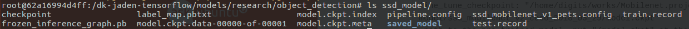
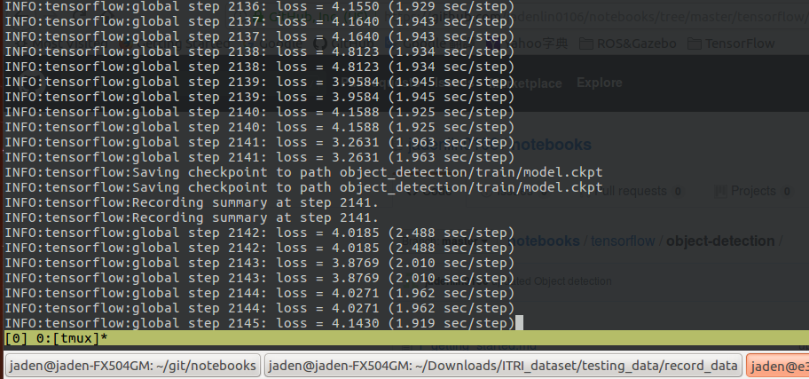
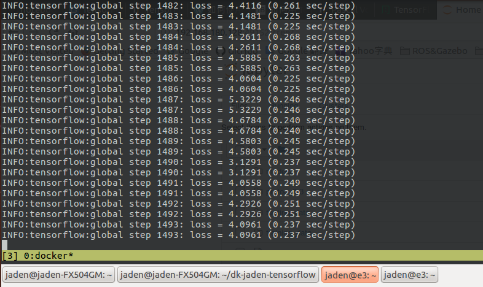
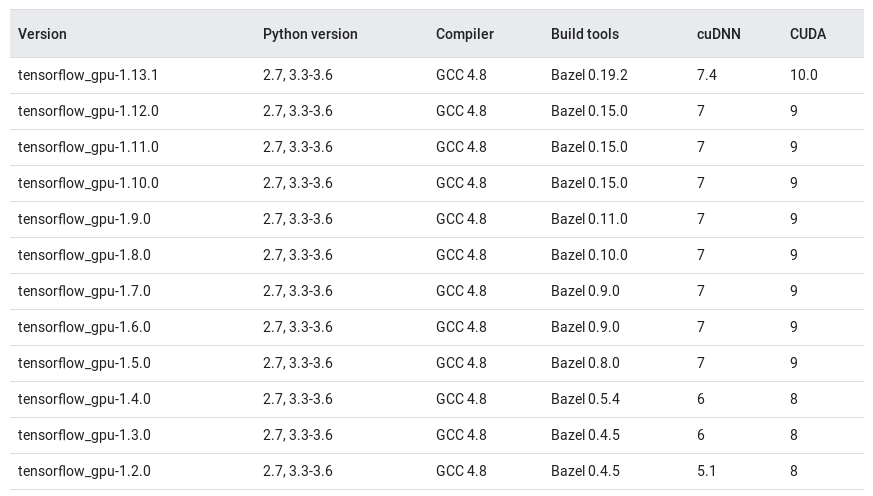

## Training

**My environment:**

tensorflow-gpu: 1.12.2

cuda: 9.0.167

python: 3.5.2

**Requirement:**

- [1_getting_started](./1_getting_started.md)
- [2_convert_VOC_to_record](./2_convert_VOC_to_record.md)

After [2_convert_VOC_to_record](./2_convert_VOC_to_record.md), you should have your tfrecord files (training and testing).

1. Preparation, in **host**:

   ```shell
   $ cd ~/dk-jaden-tensorflow/models/research/object_detection
   $ mkdir ssd_model
   $ cp ~/dk-jaden-tensorflow/training_data/record_data/t* ./ssd_model
   ```

   Move `label_map.pbtxt` file to ./ssd_model:

   ```shell
   $ mv ~/dk-jaden-tensorflow/training_data/label_map.pbtxt ./ssd_model
   ```

   The purpose of `label_map.pbtxt` is to map Class ID to Class name. looks like:

   ```pbtxt
   item {
     id: 1
     name: 'class1'
   }
   
   item {
     id: 2
     name: 'class2'
   }
   
   item {
     id: 3
     name: 'class3'
   }
   	.
   	.
   	.
   
   ```

   

2. In **host**, download pre-trained model from [here](https://github.com/tensorflow/models/blob/master/research/object_detection/g3doc/detection_model_zoo.md), and extract it like this:

   ```shell
   $ wget http://download.tensorflow.org/models/object_detection/ssd_mobilenet_v1_coco_2018_01_28.tar.gz -P ~/dk-jaden-tensorflow/
   $ tar -xzvf ~/dk-jaden-tensorflow/ssd_mobilenet_v1_coco_2018_01_28.tar.gz --directory ~/dk-jaden-tensorflow
   $ mv ~/dk-jaden-tensorflow/ssd_mobilenet_v1_coco_2018_01_28/* ./ssd_model/
   ```

   I used the "[ssd_mobilenet_v1_coco](http://download.tensorflow.org/models/object_detection/ssd_mobilenet_v1_coco_2018_01_28.tar.gz)".

   

3. Also, download model config file from [here](https://github.com/tensorflow/models/tree/master/research/object_detection/samples/configs), and modify it.

   Actually, we already have it, just copy it:

   ```shell
   $ cp ~/dk-jaden-tensorflow/models/research/object_detection/samples/configs/ssd_mobilenet_v1_coco.config ./ssd_model/
   ```

   I used the "[ssd_mobilenet_v1_coco.config](https://github.com/tensorflow/models/blob/master/research/object_detection/samples/configs/ssd_mobilenet_v1_coco.config)" here.

   Modify the config file:

   ```config
   line 9:
   	num_classes: 3
       → number of class
   	
   line 141:
       batch_size: 12
       → recommend 8-12, reduce this number if your GPU ram is not enough.
   
   line 156:
       fine_tune_checkpoint: "/dk-jaden-tensorflow/models/research/object_detection/ssd_model/model.ckpt"
       →path to the pre-trained model, put "/model.ckpt" at the tail.
   
   line 162:
       num_steps: 200000
       →When will it stop, or you can just use ctrl+c
   
   line 173:
       train_input_reader: {
         tf_record_input_reader {
           input_path: "/dk-jaden-tensorflow/models/research/object_detection/ssd_model/train.record"
               →Path to train.record.
               
   line 185 add:
   	metrics_set: "coco_detection_metrics"
               
   line 188:
       eval_input_reader: {
         tf_record_input_reader {
           input_path: "/dk-jaden-tensorflow/models/research/object_detection/ssd_model/test.record"
               →Path to test.record.
               
   line 177 and 192:
       label_map_path: "/dk-jaden-tensorflow/models/research/object_detection/ssd_model/label_map.pbtxt"
       →Path to pascal_label_map.pbtxt
   ```

   Now, your ssd_model directory should have:

   

   

4. Training:

   In **container**:

   ```shell
   $ cd /dk-jaden-tensorflow/models/research
   # Set PYTHONPATH
   $ export PYTHONPATH=$PYTHONPATH:`pwd`:`pwd`/slim
   ```

   If you didn't turn off your terminal after  [1_getting_started](./1_getting_started.md), then you don't need to set PYTHONPATH.

   Start to train:

   ```shell
   $ python object_detection/legacy/train.py --train_dir object_detection/train --pipeline_config_path object_detection/ssd_model/ssd_mobilenet_v1_coco.config
   ```

   `--train_dir`: checkpoint, model.ckpt.....output's directory.

   `--pipeline_config`_path: Path of config file.

   It will start to train.

   Using tensorflow (CPU):

   

   Using tensorflow-gpu==1.12.2 (GPU):

   

   as you can see, GPU is 10 times faster than CPU.

   

5. Evaluate:

   Modify `~/dk-jaden-tensorflow/models/research/object_detection/utils/object_detection_evaluation.py`:

   ```python
   # replace line 213:
   	category_name = unicode(category_name, 'utf-8')
   # to
   	category_name = str(category_name, 'utf-8')
   ```

   Start to evaluate, usage:

   ```shell
   $ cd /dk-jaden-tensorflow/models/research
   $ python object_detection/legacy/eval.py   --logtostderr   --pipeline_config_path=object_detection/ssd_model/ssd_mobilenet_v1_coco.config   --checkpoint_dir=object_detection/train --eval_dir=object_detection/eval
   ```

6. Monitor it by **tensorboard**:

   ```shell
   $ tensorboard --logdir /dk-jaden-tensorflow/models/research/object_detection/
   ```

   and access [Host IP:port] on your browser.

   

7. Export your "Inference"

   If you want to use your model in real situation, you need Inference.

   Usage:

   ```shell
   $ cd /dk-jaden-tensorflow/models/research
   $ python object_detection/export_inference_graph.py --input_type image_tensor --pipeline_config_path object_detection/ssd_model/ssd_mobilenet_v1_coco.config --trained_checkpoint_prefix object_detection/train/model.ckpt-497962 --output_directory object_detection/inference_497962/
   ```

   `--input_type`: When we are using it, we will send image_tensor as input.

   `--pipeline_config_path`: Path to the model's config file.

   `--trained_checkpoint_prefix`: Path to the latest check point step we trained.

   `--output_directory`: Export path.

   

8. For the IEEE MMSP object-detection competition, they request participants to hand in a submission.csv file, you can use [object_detection_inference_to_submission.ipynb](./object_detection_inference_to_submission.ipynb) to generate the file.

   Modify the python code:

   ```python
   ...
   PATH_TO_FROZEN_GRAPH = [Path to frozen detection graph where we exported]
   ...
   PATH_TO_LABELS = [Path to the label_map.pbtxt where we generated]
   ```

   ```python
   ...
   PATH_TO_TEST_IMAGES_DIR = [Path to your testing imageset]
   ...
   ```

   

9. There is an example of calculating the mean Average Precision (mAP). If you are interested in it, you can take a look: [calculate_mAP.ipynb](./calculate_mAP.ipynb).


Note:

If you encounter this while you are starting to train: 

```
............ImportError: libcublas.so.10.0: cannot open shared object file: No such file or directory
```

Check your tensorflow-gpu version:

```shell
$ pip show tensorflow
#or
$ pip show tensorflow-gpu
```

and check CUDA version:

```shell
$ cat /usr/local/cuda/version.txt
#or
$ nvcc --version
```

Compatible table: 



from: https://www.tensorflow.org/install/source#gpu_support_2


Previous: [2_convert_VOC_to_record](./2_convert_VOC_to_record.md)